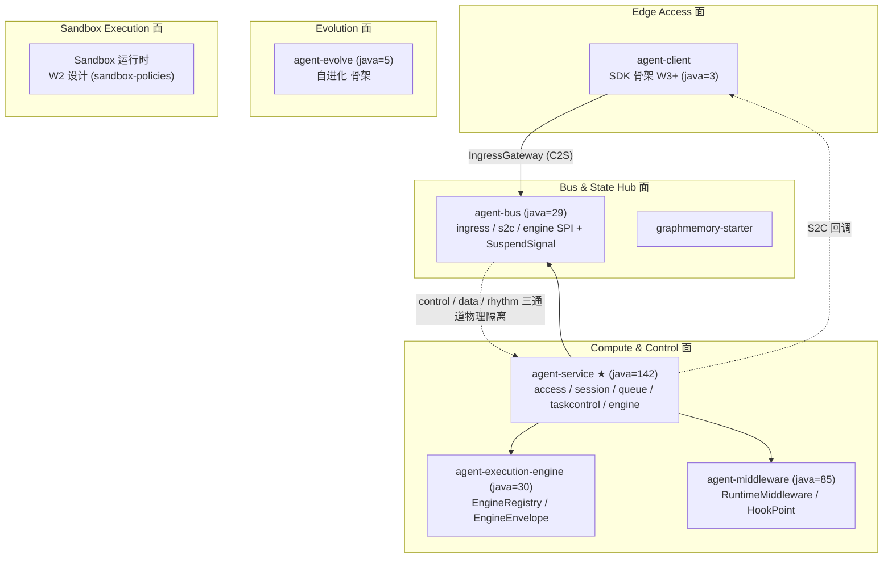
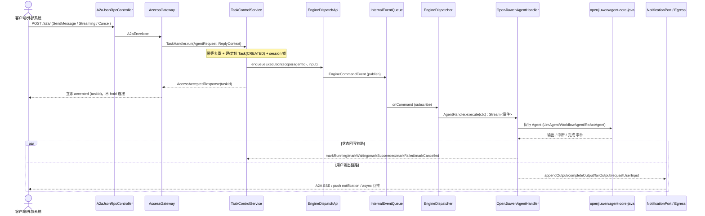
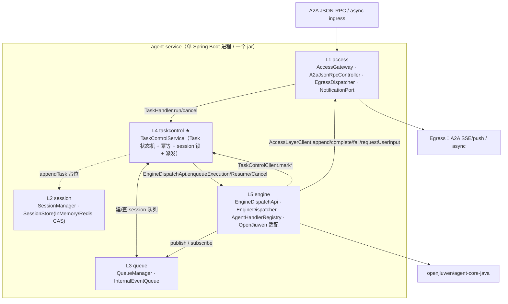
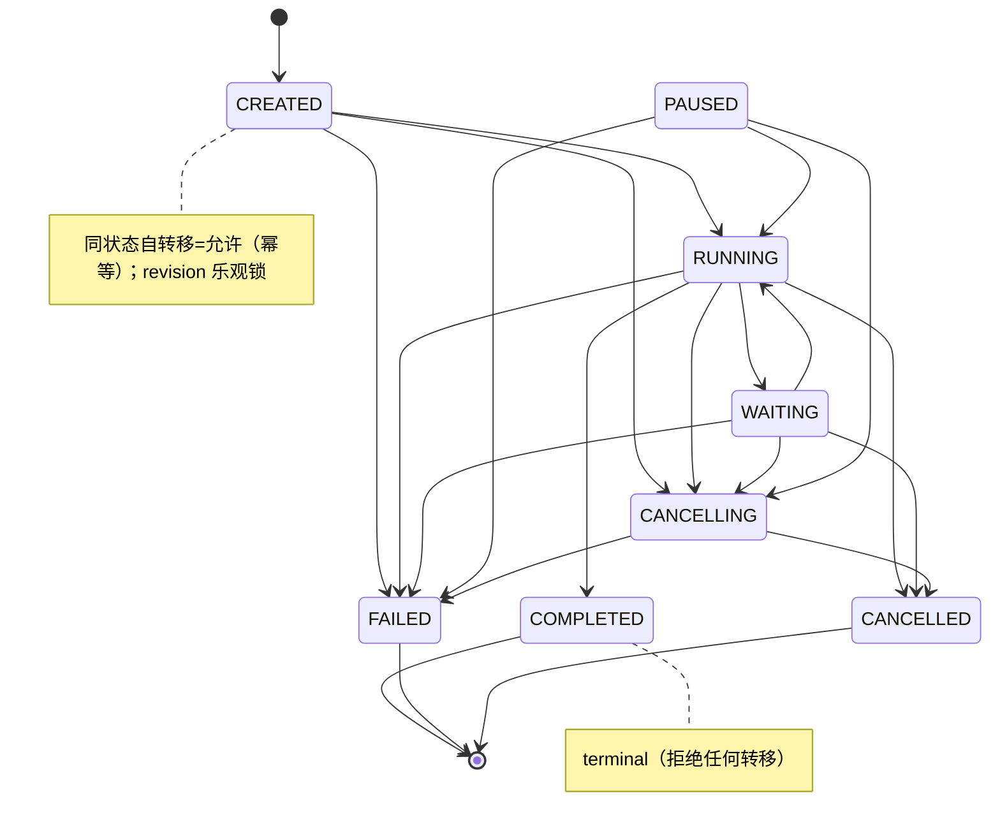
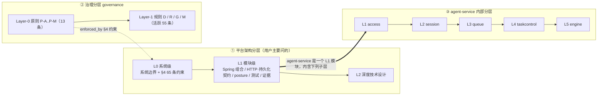
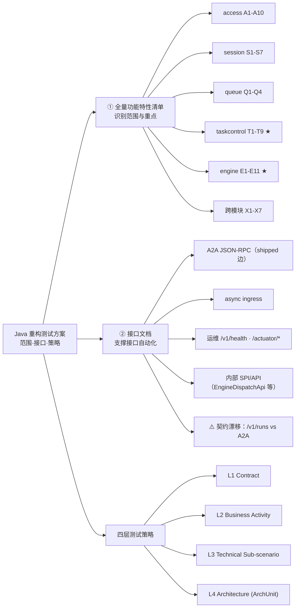
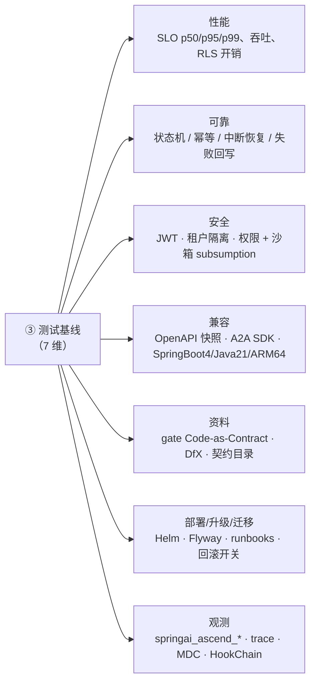
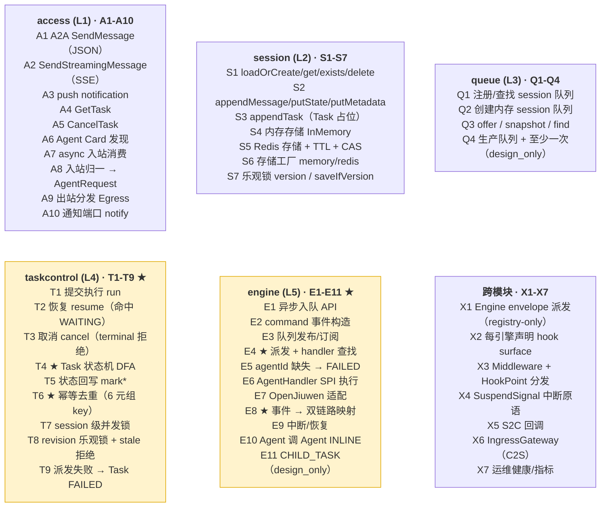

# 交付件 5 · 图示总结（四份文档的可视化）

> 用 Mermaid 图表代码表达，可在 GitHub / VS Code / 各类 Markdown 预览器里直接渲染为图片。
> 对应文档：[01](01-architecture-summary.md) / [02](02-agent-service-deep-dive.md) / [03](03-l0-l1-architecture.md) / [04](04-java-refactor-test-plan.md)。
> 已导出静态 PNG 至 [`images/`](images/)（用 `@mermaid-js/mermaid-cli` 渲染，scale 2、白底）。下方「静态图片」直接展示，其后保留 Mermaid 源码便于编辑。

---

## 静态图片（PNG 总览）

### 图 1 · 系统全景：8 模块 × 5 部署面

### 图 2 · 智能体端到端流程

### 图 3 · agent-service 内部五层与数据流

### 图 4 · Task 状态机 DFA

### 图 5 · 三套「L 编号」语义

### 图 6a · 测试方案：范围 / 接口 / 策略

### 图 6b · 测试方案：七维测试基线

### 图 6c · 功能点编号图例（A/S/Q/T/E/X 各编号含义）

---

## Mermaid 源码

## 图 1 · 系统全景：8 模块 × 5 部署面（对应文档 01）

> 结论：6 模块已全部 Java 化；agent-service 最完整（★），其余为 SPI/骨架。总线面跨服务流量切成 control（永不阻塞）/ data / rhythm 三通道。

---

## 图 2 · 智能体端到端流程（对应文档 01 §4 / 02）

> 两点核心：①入队即返回（异步执行）；②引擎事件分裂成「状态回写」+「用户输出」两条独立链路。

---

## 图 3 · agent-service 内部五层与数据流（对应文档 02）

> 入口装配：`AgentServiceApplication` 只扫 `access`+`bootstrap`，其余经 AutoConfiguration 导入；`AgentServiceBootstrapConfiguration` 提供 2 个跨层 seam（入站 AccessTaskHandler、出站 AccessNotificationClient）。

---

## 图 4 · Task 状态机 DFA（对应文档 02 §5.1，强测试点）

---

## 图 5 · 三套「L 编号」语义（对应文档 03）

> 一句话：**L0 定义平台被允许成为什么，L1 定义每个 Spring 模块被允许如何成为它。** L1 不是成熟度标签（成熟度由 `architecture-status.yaml` 的二元 `shipped:` 决定）。

---

## 图 6a · 测试方案：范围 / 接口 / 策略（对应文档 04 §1·§2）

## 图 6b · 测试方案：七维测试基线（对应文档 04 §3）

> 现状标注贯穿全表：`shipped` / `partial` / `stub` / `design_only` / `schema_shipped`，避免把设计目标当已实现。

---

## 图 6c · 功能点编号图例（对应文档 04 §1）

> 命名规则：**字母 = agent-service 内部层**（A=access·S=session·Q=queue·T=taskcontrol·E=engine·X=跨模块），**数字 = 该层第几个功能点**，**★ = 测试重点**。黄色块（taskcontrol / engine）为核心闭环、优先测。

> 合计约 48 个功能点；taskcontrol(T) 与 engine(E) 为核心闭环（★），是功能/可靠性测试的首要对象。明细见 [04-java-refactor-test-plan.md](04-java-refactor-test-plan.md) §1 各表（含可见性 / shipped·stub 现状 / 关键类 / 建议测试层）。

---

## 渲染说明

- 上述图均为 **Mermaid** 代码，GitHub、VS Code（Markdown Preview Mermaid 插件）、Obsidian、Typora 等可直接显示为图片。
- 如需导出为 PNG/SVG 静态图：`npx @mermaid-js/mermaid-cli -i 05-diagrams.md -o diagrams.png`（需 Node 环境）。
- 仓库已有 PlantUML 视图（`docs/architecture/l0/architecture-views/plantuml`）与 Structurizr 权威模型（`architecture/workspace.dsl`），如需与官方视图风格统一可改用 PlantUML 重绘。
